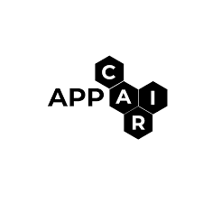

I'm Ayush Ghatalia, third year Computer Science student (with a minor in Finance) at [BITS Pilani](https://www.bits-pilani.ac.in/goa/).

I'm passionate about exploring the intersection of finance and technology. With a background in both finance and computer science, I thrive on the dynamic interplay between numbers and algorithms, always seeking to build innovative solutions.

My journey began with a fascination for finance, where I discovered the power of numbers in understanding markets and making informed decisions. Over time, my interest evolved to encompass the world of computer science, drawn to its capacity for problem-solving and creating practical applications.

I love the process of building things—whether it's a complex algorithm for financial analysis or a sleek software interface that simplifies user experience.

Recently, I've been diving deep into the quantitative side of finance, exploring mathematical models and statistical methods to gain deeper insights into market behavior. It's an exciting journey filled with discovery and endless possibilities.

<!-- ### My research experiance spans working with:

 &ensp; [Yaman Kumar](https://sites.google.com/view/yaman-kumar/) at Adobe Research

 &ensp; [Adriana Kovashka](https://people.cs.pitt.edu/~kovashka/) at University of Pittsburgh

 &ensp; [APPCAIR](https://web.bits-pilani.ac.in/APPCAIR/) at BITS Pilani

 &ensp; [Sravan Danda](https://scholar.google.com/citations?user=5kSGWFoAAAAJ&hl=en) at BITS Pilani

**My recent research work** - "[Large Content And Behavior Models To Understand, Simulate, And Optimize Content And Behavior](https://arxiv.org/abs/2309.00359)", done in collaboration with Adobe Research, has been accepted as a Spotlight paper at the *International Conference on Learning Representations (ICLR) 2024*. 

**I've worked on** simulating human behavior using large language models, integrating vision in language models, semi-supervised segmentation, neural network pruning, Bayesian networks, and mass data scraping and processing. Check out my [CV](https://ashmitkx.github.io/files/ashmit-khandelwal-cv.pdf) for more details.

# Updates

_Jan '24_ - "[Large Content And Behavior Models To Understand, Simulate, And Optimize Content And Behavior](https://arxiv.org/abs/2309.00359)" has been accepted as a Spotlight paper at ICLR 2024!

_Sep '23_ - My work on "[Large Content And Behavior Models To Understand, Simulate, And Optimize Content And Behavior](https://arxiv.org/abs/2309.00359)" is available on arXiv.

_Jun '23_ - I'll be working remotely with Dr. Adriana Kovashka at the University of Pittsburgh as a Research Assistant.

_Jan '23_ - I'll be working as a Research Assistant with [APPCAIR](https://www.bits-pilani.ac.in/appcair/) and [Wadhwani AI](https://www.wadhwaniai.org/) during the spring semester.

_Nov '22_ - I'll be joining [Adobe Media and Data Science Research](https://research.adobe.com/) as a Research Intern.

_Nov '22_ - I'll be an instructor for the Introduction to ML and DL course by Center of Technical Education, BITS Pilani, Goa.

<!-- _Sept '22_ - Offered a research internship at Adobe Media and Data Science Research, for summer 2023. -->

<!-- _July '22_ - Selected to attend the [6th Summer School on AI](http://cvit.iiit.ac.in/summerschool2022/index.php) organized by CVIT, IIITH. -->

<!-- _July '22_ - I'll be an instructor for the Introduction to Deep Learning course by Quark Controls, BITS Pilani - Goa. -->

<!-- _July '22_ - Selected to attend [Amazon ML Summer School 2022](https://amazonmlsummerschoolindia.splashthat.com/). -->

<!-- _May '22_ - Interning at [National Centre for Polar and Ocean Research](https://ncpor.res.in/), working on Antarctic weather forecasting research. -->

<!--   --> -->

<!--  -->
